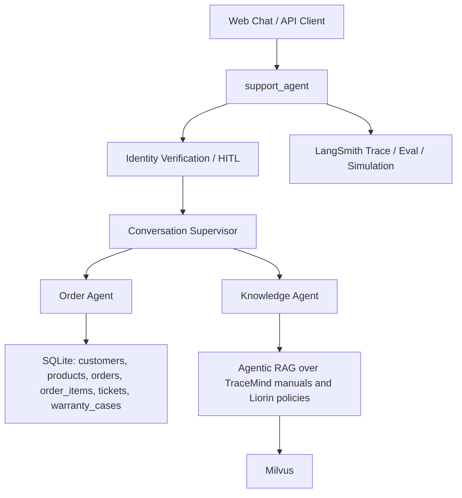

# Liorin

Liorin 是一个面向企业技术产品与订单售后的可信客服 Agent 平台。项目基于 LangGraph 构建多 Agent 编排，结合 TraceMind 产品手册、结构化订单/工单/质保数据、身份验证、离线评测和仿真流量，用来探索真实客服 Agent 的工程化落地。

当前仓库已经从教程演示版整理为干净的项目形态：只保留一条生产图 `support_agent`，数据语境统一为 Liorin + TraceMind。

## 项目定位

Liorin 面向以下客服场景：

- 技术产品咨询：规格、使用方式、故障排查、保养说明。
- 订单售后：订单状态、物流、历史购买、取消原因、退款前置判断。
- 维修与质保：工单状态、质保覆盖、维修下一步。
- 企业客户上下文：租户、客户身份、企业设备售后记录。

## 架构



## 核心模块

```text
agents/
  support_workflow.py          # 身份验证 + Supervisor 的生产图
  conversation_supervisor.py   # 会话路由与最终答复
  order_agent.py               # 只读 SQL 结构化数据查询
  knowledge_agent.py           # 产品手册与售后政策检索

tools/
  database.py                  # 只允许 SELECT 的数据库工具
  documents.py                 # 手册/政策向量检索工具

deployments/
  support_agent_graph.py       # LangGraph 部署入口

data/
  knowledge/                   # TraceMind 手册和 Liorin 售后政策
  structured/                  # Liorin 客户、订单、工单、质保数据
  data_generation/             # 数据与向量库重建脚本

evals/
  baseline_dataset.json        # CI 基线评测集
  benchmark/                   # Liorin Agentic RAG Benchmark v7.3 数据、adapter、scorer
  annotation_pipeline/         # 双 Agent 独立标注 + C 分歧仲裁 + 人工复核流水线
  scripts/                     # 标注运行、审计、复核和导出脚本
  tracemind/                   # TraceMind 原始评测/公开问题数据

simulations/
  scenarios.json               # Liorin 仿真场景
  run_simulation.py            # LangSmith trace 生成
```

## 技术栈如何落地

- LangChain：创建 `order_agent`、`knowledge_agent` 和 `conversation_supervisor`，并封装 SQL/检索工具。
- LangGraph：定义生产图 `support_agent`，把查询分类、身份验证、中断恢复和 Supervisor 串成可部署工作流。
- MCP：当前还没有独立 MCP Server；下一阶段适合把维修工单、退款申请、订单取消等动作封装为 MCP Tools。
- Agentic RAG：`knowledge_agent` 主动调用手册/政策检索工具，基于 TraceMind 手册和 Liorin 政策回答问题。
- Context Engineering：通过 `Context`、`customer_id` 状态、Supervisor prompt 和数据库 schema 注入运行时上下文。
- Human-in-the-loop：账户/订单类问题先验证邮箱；高风险动作目前只判断资格和下一步，不直接执行。
- Agent Evaluation：`evals/run_ci_eval.py` 将 `baseline_dataset.json` 同步到 LangSmith 数据集并执行回归评测。
- Agent Observability：仿真脚本和 LangSmith tracing 用于生成多轮客服轨迹、观察工具调用和失败案例。

## 快速开始

```bash
uv sync
copy .env.example .env
uv run python data/data_generation/create_database.py
uv run python data/data_generation/validate_database.py
uv run python data/data_generation/build_vectorstore.py
uv run langgraph dev
```

本地 LangGraph 会读取 `langgraph.json`：

```json
{
  "graphs": {
    "support_agent": "./deployments/support_agent_graph.py:graph"
  }
}
```

## 环境变量

```bash
LIORIN_MODEL=openai:deepseek-chat
# Set OPENAI_API_KEY in your shell or secret manager.
OPENAI_BASE_URL=https://api.deepseek.com
EMBEDDING_PROVIDER=huggingface
MILVUS_URI=http://localhost:19530
MILVUS_TOKEN=
MILVUS_COLLECTION=liorin_documents_huggingface
LANGSMITH_TRACING=false
# Set LANGSMITH_API_KEY only when tracing is enabled.
LANGGRAPH_DEPLOYMENT_URL=
```

默认 embedding 使用 HuggingFace，可在本地无 API Key 构建向量库。使用 OpenAI embedding 时设置：

```bash
EMBEDDING_PROVIDER=openai
# Set OPENAI_API_KEY in your shell or secret manager.
```

## 数据

Liorin 当前数据来自两部分：

- TraceMind：产品手册、公开问题、多轮评测集。
- Liorin：围绕 TraceMind 产品生成的客户、订单、工单、质保样例数据。

关键路径：

```text
data/knowledge/manuals/
data/knowledge/policies/
data/structured/liorin.db
evals/tracemind/
```

当前结构化数据规模：

- `customers`: 300
- `products`: 20
- `orders`: 1,500
- `order_items`: 3,000+
- `tickets`: 420+
- `warranty_cases`: 140

结构化数据由可复现生成器构建，并带有基础业务因果关系：客户活跃度通过 `activity_score` 形成长尾分布；取消订单保留商品明细、原始金额和 `cancel_reason`；订单日期决定生命周期状态；产品类型决定数量分布和常见问题；工单只从真实已发货或已交付订单明细生成；跟进工单引用父工单；质保案例只由根工单升级而来，同一业务故障链最多生成一个质保案例；`coverage_type` 表示厂家质保或延保，`coverage_status` 表示当前是否过保。

## 评测与仿真

```bash
uv run python evals/run_ci_eval.py
uv run python -m evals.benchmark.cli smoke
uv run python -m evals.benchmark.cli run --dataset validation --report evals/reports/benchmark_validation_report.json
uv run python simulations/run_simulation.py --count 3 --mode static
```

CI 默认执行离线 benchmark smoke 和旧本地 smoke，不会重建远程 LangSmith 数据集。仿真默认目标图为 `support_agent`。

## Benchmark 与标注流水线

正式评测入口：

```bash
# 快速离线 smoke：每层至少跑一个公开 validation 样本
uv run python -m evals.benchmark.cli smoke

# 生成真实生产 adapter predictions，并按 v7.3 validation gold 评分
uv run python -m evals.benchmark.cli run --dataset validation --report evals/reports/benchmark_validation_report.json

# 仅对指定层评分，支持 partial submission
uv run python -m evals.benchmark.cli score evals/reports/benchmark_predictions.json --dataset-path evals/benchmark/data/validation_v7_3.json --layers retrieval --allow-partial

# Blind 只生成 inputs 的 predictions；Blind Gold 必须由外部保管方注入评分
uv run python -m evals.benchmark.cli run --dataset blind --predictions evals/reports/blind_predictions.json --allow-partial
```

Benchmark adapter 调用当前生产 `knowledge_agent.py`、`retrieval/hybrid_retriever.py` 和 `retrieval/database_retriever.py`。生产 `chunk_id` 只有在与公开 benchmark manifest 精确一致时才映射为 benchmark chunk ID；映射不到会进入 diagnostics 的 `unmapped_chunk_ids`。

多 Agent 标注流程：

```bash
# Mock 只验证流程，不是语义标注结果
uv run python evals/scripts/run_multi_agent_annotation.py --config evals/configs/mock_flow_test.yaml
uv run python evals/scripts/audit_annotation_pipeline.py --run-dir evals/annotation_runs/mock_flow_test
uv run python evals/scripts/check_agreement_thresholds.py evals/annotation_runs/mock_flow_test/agreement_report.json --manifest evals/annotation_runs/mock_flow_test/run_manifest.json

# 真实三模型配置示例。API Key 只通过 *_API_KEY 环境变量读取
uv run python evals/scripts/run_multi_agent_annotation.py --config evals/configs/annotators.example.yaml
```

人工复核与导出：

```bash
uv run python evals/scripts/apply_human_reviews.py --run-dir evals/annotation_runs/mock_flow_test --reviews path/to/reviews.json --output evals/reports/reviewed_annotations.json
uv run python evals/scripts/export_reviewed_dataset.py --dataset evals/benchmark/data/dev_v7_3.json --reviewed-annotations evals/reports/reviewed_annotations.json --output evals/reports/dev_reviewed_v7_4.json
```

默认导出会保留旧 `gold`，把新结果写入 `reviewed_gold_v7_4`；只有显式传入 `--replace-gold` 才会覆盖。对外报告应表述为“双 Agent 独立标注、第三 Agent 分歧仲裁，并由人工复核全部分歧、高风险和随机抽样样本”。不要把 Mock 一致性或 `fact_coverage_proxy` 称为真实语义可靠性或答案正确率。

## 当前边界

项目已经具备可信客服 Agent 的核心骨架，但仍有几类能力处于下一阶段：

- MCP Server 尚未独立实现。
- 订单取消、退款、维修工单创建还未作为真实动作执行。
- RBAC、审批策略、Verifier Agent、独立 Trace Console 还未补齐。
- OCR/截图理解、混合检索、reranker、Evidence Coverage 评测仍待从 TraceMind 继续迁移。

## 推荐改造路线

1. 完成 Liorin 领域建模：扩展 Schema、租户上下文、权限策略和真实售后动作。
2. 迁移 TraceMind 强项：混合检索、reranker、OCR/截图理解、多轮澄清、source top-k 与 topic switch 评测。
3. 补齐企业 Agent 治理：MCP Server、RBAC、高风险 HITL、Verifier、trajectory evaluation、Trace Console 与回归 CI。
