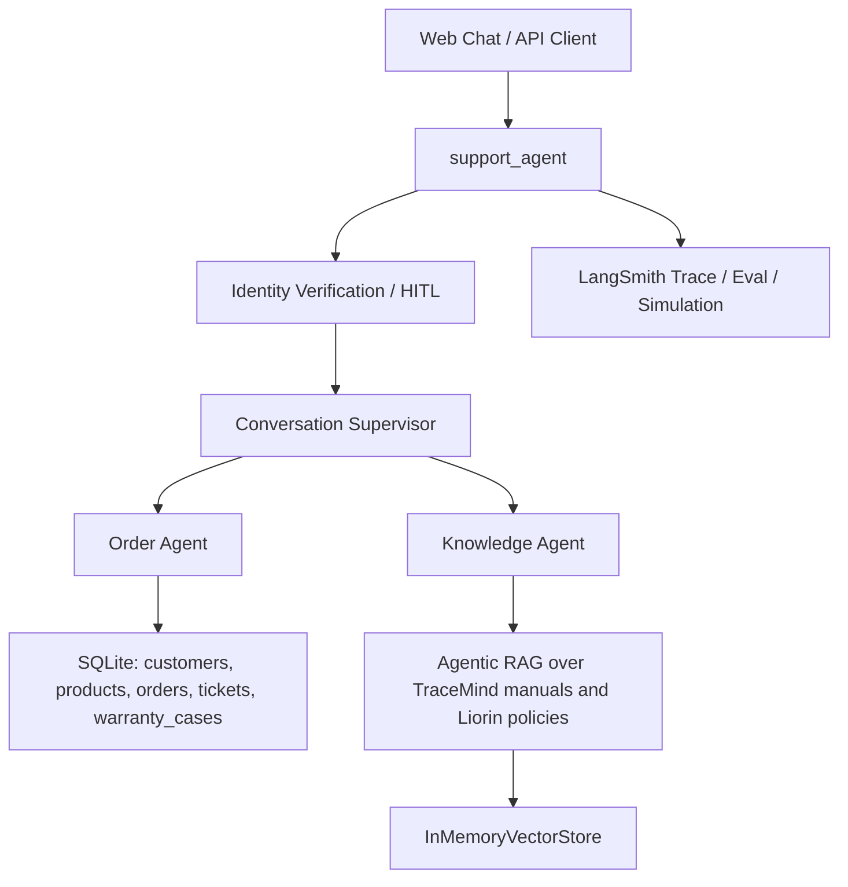

# Liorin

Liorin 是一个面向企业技术产品与订单售后的可信客服 Agent 平台。项目基于 LangGraph 构建多 Agent 编排，结合 TraceMind 产品手册、结构化订单/工单数据、身份验证、离线评测与仿真流量，用来探索真实客服 Agent 的工程化落地。

当前仓库已经从教程演示版收束为干净的项目形态：只保留一条生产图 `support_agent`，数据语境统一为 Liorin + TraceMind。

## 项目定位

Liorin 面向这类场景：

- 技术产品售前咨询：规格、使用方式、故障排查、保养说明。
- 订单售后：订单状态、物流、历史购买、取消资格、退款前置判断。
- 维修与保修：工单状态、保修覆盖、维修下一步。
- 企业客户上下文：租户、客户身份、企业设备售后记录。

## 架构



## 核心模块

```text
agents/
  support_workflow.py          # 身份验证 + Supervisor 的生产图
  conversation_supervisor.py   # 会话路由与最终答复
  order_agent.py               # 只读 SQL 结构化数据查询
  knowledge_agent.py           # 产品手册与售后政策检索

tools/
  database.py                  # 只允许 SELECT 的数据库工具
  documents.py                 # 手册/政策向量检索工具

deployments/
  support_agent_graph.py       # LangGraph 部署入口

data/
  knowledge/                   # TraceMind 手册和 Liorin 售后政策
  structured/                  # Liorin 订单、客户、工单、保修数据
  data_generation/             # 数据库与向量库重建脚本

evals/
  baseline_dataset.json        # CI 基线评测集
  tracemind/                   # TraceMind 原始评测/公开问题数据

simulations/
  scenarios.json               # Liorin 仿真场景
  run_simulation.py            # LangSmith trace 生成
```

## 技术栈如何落地

- LangChain：用于创建 `order_agent`、`knowledge_agent` 和 `conversation_supervisor`，并封装 SQL/检索工具。
- LangGraph：定义生产图 `support_agent`，把查询分类、身份验证、中断恢复和 Supervisor 串成可部署工作流。
- MCP：当前代码还没有独立 MCP Server；下一阶段适合把维修工单、退款申请、订单取消等动作封装成 MCP Tools。
- Agentic RAG：`knowledge_agent` 会主动调用手册/政策检索工具，基于 TraceMind 手册和 Liorin 政策回答问题。
- Context Engineering：通过 `Context`、`customer_id` 状态、Supervisor prompt 和数据库 schema 注入运行时上下文。
- Human-in-the-loop：账号/订单类问题会先验证邮箱；高风险动作目前只判断资格和下一步，不直接执行。
- Agent Evaluation：`evals/run_ci_eval.py` 将 `baseline_dataset.json` 同步到 LangSmith 数据集并执行回归评测。
- Agent Observability：仿真脚本和 LangSmith tracing 用于生成多轮客服轨迹、观察工具调用和失败案例。

## 快速开始

```bash
uv sync
copy .env.example .env
uv run python data/data_generation/create_database.py
uv run python data/data_generation/validate_database.py
uv run python data/data_generation/build_vectorstore.py
uv run langgraph dev
```

本地 LangGraph 会读取 `langgraph.json`：

```json
{
  "graphs": {
    "support_agent": "./deployments/support_agent_graph.py:graph"
  }
}
```

## 环境变量

```bash
LIORIN_MODEL=anthropic:claude-haiku-4-5
EMBEDDING_PROVIDER=huggingface
LANGSMITH_TRACING=false
LANGSMITH_API_KEY=
LANGGRAPH_DEPLOYMENT_URL=
```

默认 embedding 使用 HuggingFace，可在本地无 API Key 构建向量库。使用 OpenAI embedding 时设置：

```bash
EMBEDDING_PROVIDER=openai
OPENAI_API_KEY=...
```

## 数据

Liorin 当前数据来自两部分：

- TraceMind：产品手册、公开问题、多轮评测集。
- Liorin：围绕 TraceMind 产品生成的客户、订单、工单、保修样例数据。

关键路径：

```text
data/knowledge/manuals/
data/knowledge/policies/
data/structured/liorin.db
evals/tracemind/
```

## 评测与仿真

```bash
uv run python evals/run_ci_eval.py
uv run python simulations/run_simulation.py --count 3 --mode static
```

CI 评测数据集名称为 `liorin-tracemind-baseline-ci`。仿真默认目标图为 `support_agent`。

## 当前边界

项目已经具备可信客服 Agent 的核心骨架，但仍有几类能力处于下一阶段：

- MCP Server 尚未独立实现。
- 订单取消、退款、维修工单创建还未作为真实动作执行。
- RBAC、审批策略、Verifier Agent、独立 Trace Console 还未补齐。
- OCR/截图理解、混合检索、reranker、Evidence Coverage 评测尚待从 TraceMind 继续迁移。

## 推荐改造路线

1. 完成 Liorin 领域建模：扩展 Schema、租户上下文、权限策略和真实售后动作。
2. 迁移 TraceMind 强项：混合检索、reranker、OCR/截图理解、多轮澄清、source top-k 与 topic switch 评测。
3. 补齐企业 Agent 治理：MCP Server、RBAC、高风险 HITL、Verifier、trajectory evaluation、Trace Console 与回归 CI。
