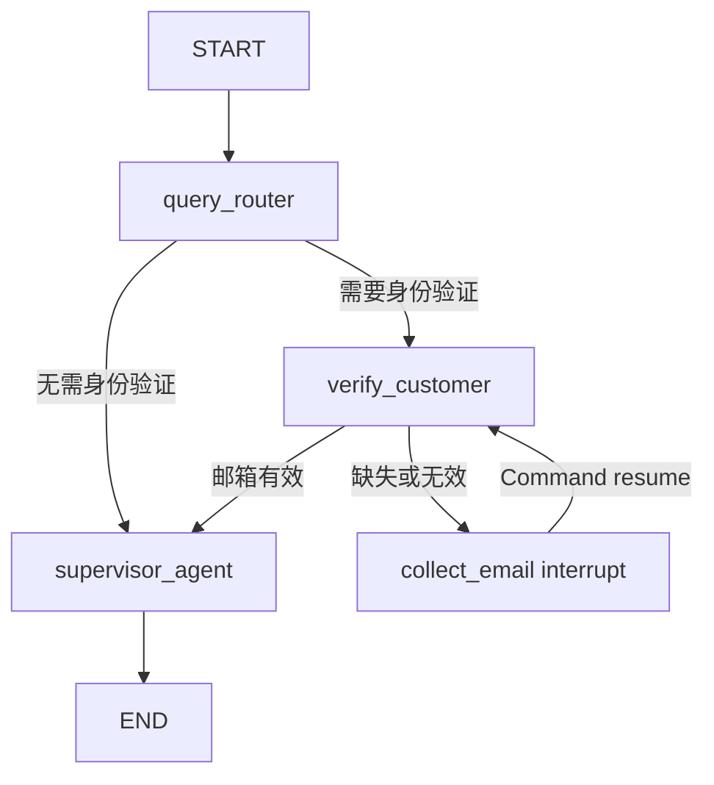
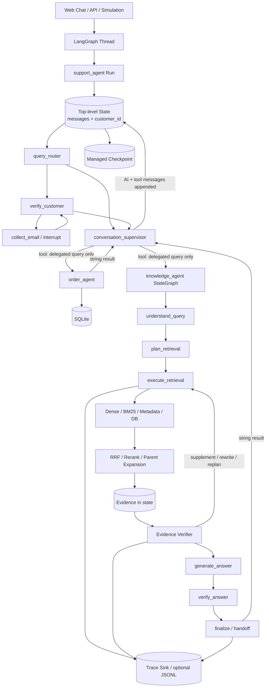
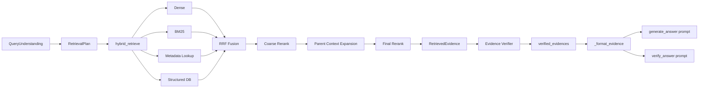
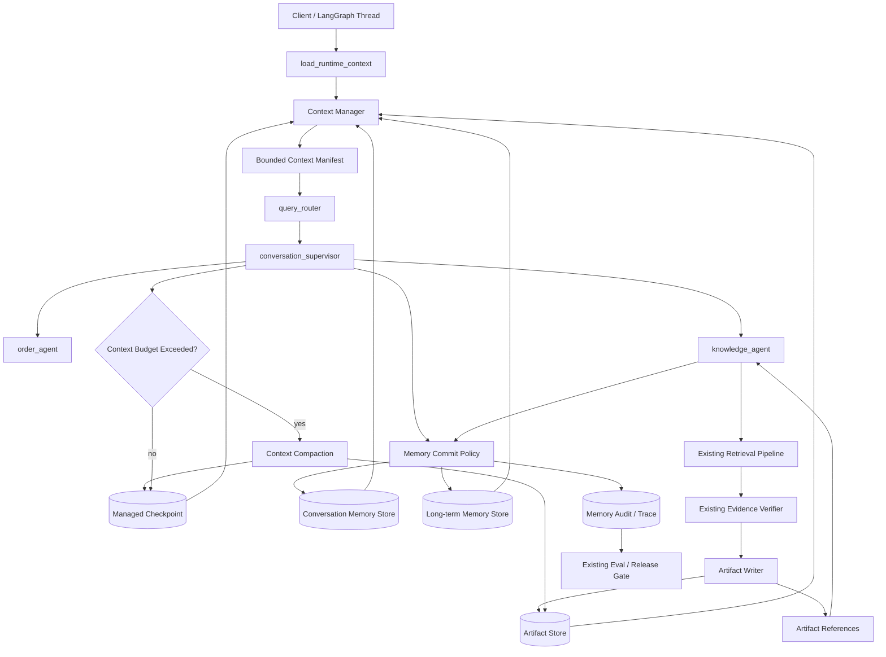

# Liorin Memory Architecture Audit

> Phase 0 交付物。本文基于当前真实仓库 `Liorin-main (2)(1).zip` 的代码审计结果编写。
>
> 本阶段只新增本审计文档，不修改 Agent、Retrieval、Evidence、Governance、Evaluation 或部署业务代码。

## 1. 审计结论

Liorin 当前已经具备 **LangGraph 状态、线程级 checkpoint、消息历史、请求内 Agentic RAG 状态和结构化 trace**，但这些能力还不能等同于完整的 Memory / Context Engineering。

当前系统的核心事实是：

1. **跨轮持久化边界在顶层 `support_agent`**。生产部署通过 LangGraph 托管线程与持久化保存顶层图状态。
2. **顶层跨轮状态只有 `messages` 和 `customer_id`**。没有任务摘要、已确认事实、未完成事项、上下文预算、记忆引用或压缩快照。
3. **Supervisor 直接消费持续增长的完整消息轨迹**。其中不仅有用户与助手消息，还可能包含工具调用和子 Agent 返回文本。
4. **Order Agent 与 Knowledge Agent 在 Supervisor 工具内部以新状态调用**。它们只收到主管重新描述后的单条 query，未显式继承顶层 `session_id`、`principal`、历史事实或上下文快照。
5. **Knowledge Agent 已有丰富的请求内 Working State**，但它是检索执行状态，不是经过生命周期治理的 Memory。其状态中重复保存证据正文、父章节、候选文档、验证副本、检索响应和 trace，容易造成 checkpoint/state 体积膨胀。
6. **当前 `config.Context` 只是运行时模型配置**，不是会话上下文，也没有 Memory Store、Artifact Store、Context Policy 等依赖。
7. **Retrieval 已经有上下文字符预算**，但该预算只约束父章节扩展，不约束顶层消息历史、Supervisor 工具轨迹、Order Agent schema、Knowledge Agent 多次 LLM prompt 或完整 checkpoint 大小。
8. **现有评测框架可作为 Memory 评测底座**，但当前 adapter 基本按单轮运行；多轮 conversation 数据没有被完整注入生产状态，也没有 memory selection、compaction manifest 和 token-before/after 等可评分输出。

因此，Memory / Context Engineering 的正确接入方式不是新增独立 Memory Agent，也不是替换现有图，而是：

- 以 `agents/support_workflow.py` 的顶层线程状态作为 **会话生命周期所有者**；
- 以 `agents/conversation_supervisor.py` 的 dynamic prompt middleware 作为 **统一上下文装配入口**；
- 以 `agents/knowledge_agent.py` 的结构化 state 和 Retrieval/Evidence 结果作为 **Working Memory 与 Artifact Memory 的生产者/消费者**；
- 以 LangGraph 托管 checkpoint 保存可恢复的小型状态，以独立、受治理的 Store 保存长期记忆和大体积 Artifact；
- 通过现有 `evals/benchmark`、`retrieval_evaluation.py`、trace 和 release gate 增量增加 Memory 指标。

---

## 2. 审计范围与方法

### 2.1 重点审计目录

```text
agents/
deployments/
retrieval/
evals/
evaluators/
tests/
config.py
langgraph.json
simulations/
```

### 2.2 重点追踪对象

- Agent 创建、编译、调用和结束位置；
- LangGraph input/state/output/context schema；
- `messages` reducer、checkpoint 和 thread 生命周期；
- Supervisor、Order Agent、Knowledge Agent 的 prompt 构造；
- Retrieval evidence 从召回到最终回答的完整数据流；
- Evidence、trace、budget 在 state 中的保存方式；
- Benchmark adapter 如何构建生产输入和采集预测；
- 现有测试对 checkpoint-safe state 的覆盖。

### 2.3 本阶段变更边界

本阶段没有修改任何业务代码。唯一新增文件：

```text
docs/MEMORY_ARCHITECTURE_AUDIT.md
```

---

# 3. 当前 Agent Runtime

## 3.1 生产请求入口

生产图注册链路为：

```text
langgraph.json
  -> deployments/support_agent_graph.py:graph
  -> agents.support_workflow.create_support_agent(...)
  -> compiled graph name = support_agent
```

关键位置：

- `langgraph.json:3-5`：注册 `support_agent`；
- `deployments/support_agent_graph.py:7-13`：创建 Order Agent、Knowledge Agent 和顶层 Support Graph；
- `agents/support_workflow.py:178-219`：定义并编译完整客服图。

外部客户端通过 LangGraph thread/run 调用该图。仓库中的仿真入口展示了真实线程生命周期：

```text
sdk_client.threads.create(...)
  -> 获得 thread_id
  -> sdk_client.runs.wait(thread_id, "support_agent", input=...)
  -> 后续轮次继续使用同一个 thread_id
  -> interrupt 时用 Command(resume=...) 恢复
```

对应代码位于 `simulations/run_simulation.py:97-241`。

因此，当前系统中：

- **用户请求的逻辑入口**是 `support_agent` 的 `MessagesState` input；
- **会话身份**由 LangGraph `thread_id` 承载；
- **中断恢复**由 LangGraph checkpoint + `Command(resume=...)` 承载；
- 仓库没有额外 Web Controller 或 FastAPI Controller，LangGraph deployment 本身就是当前 API/runtime 入口。

## 3.2 顶层 Agent 生命周期

顶层流程定义在 `agents/support_workflow.py`：



生命周期说明：

1. 输入进入 `MessagesState`；
2. `query_router` 读取最后一条消息，判断是否需要身份验证；
3. 需要验证时，从当前消息抽取邮箱并查询数据库；
4. 缺少邮箱时通过 `interrupt()` 暂停；
5. 恢复后把用户输入追加为 `HumanMessage`；
6. 验证成功后把 `customer_id` 写入顶层 state；
7. `supervisor_agent` 读取顶层消息轨迹并调用专业 Agent；
8. Supervisor 的最终消息写回顶层 `messages`；
9. LangGraph runtime 持久化本轮后的顶层 state。

## 3.3 State 如何传递

### 顶层 State

`IntermediateState` 继承 `MessagesState`，只增加：

```python
customer_id: str
```

顶层图配置：

```text
input_schema  = MessagesState
state_schema  = IntermediateState
output_schema = MessagesState
context_schema = Context
```

其实际含义：

- 输入只要求 `messages`；
- 图内部保存 `messages + customer_id`；
- 对外输出主要暴露 `messages`；
- `Context` 当前只提供 `model` 字段。

节点通过以下方式修改 state：

- 普通节点返回 dict；
- 路由节点返回 `Command(goto=...)`；
- 身份验证节点返回 `Command(update=..., goto=...)`；
- `messages` 使用 LangGraph message reducer 追加，而不是覆盖全部历史。

### Supervisor State

`conversation_supervisor.create_supervisor_agent()` 使用：

```text
state_schema = IntermediateState
context_schema = Context
```

Supervisor 作为顶层图节点执行，因此会读取共享的顶层 `messages` 和 `customer_id`。

Supervisor 的 dynamic prompt 当前只做一项上下文注入：

```text
如果 state.customer_id 存在：
  在系统 prompt 后追加“当前会话已验证客户 ID”
```

### 子 Agent State

Supervisor 的两个工具以全新输入调用专业 Agent：

```python
order_agent.invoke({"messages": [{"role": "user", "content": query}]})
knowledge_agent.invoke({"messages": [{"role": "user", "content": query}]})
```

这意味着：

- 顶层完整消息历史没有直接传给子 Agent；
- 子 Agent 只知道 Supervisor 生成的委托 query；
- 顶层 `customer_id` 不会自动作为子 Agent state 字段传入；
- `session_id`、`principal`、用户偏好、历史实体也没有统一传播；
- 子 Agent 的最终回答被转换为字符串，作为 Supervisor tool output 回到顶层消息轨迹。

这种隔离避免了子 Agent 无限制继承顶层历史，但也造成了上下文丢失和身份/权限传播不完整。

## 3.4 Graph 如何保存状态

当前有两种运行模式。

### 本地工厂默认模式

以下工厂默认 `use_checkpointer=True`，并创建进程内 `MemorySaver`：

- `create_order_agent()`；
- `create_knowledge_agent()`；
- `create_supervisor_agent()`；
- `create_support_agent()`。

该模式适合本地恢复和测试，但 `MemorySaver`：

- 只在当前进程内有效；
- 不是企业长期记忆；
- 不提供记忆分类、重要性、删除语义、TTL、ACL 或召回策略；
- 不能替代持久化数据库或 LangGraph managed store。

### 生产部署模式

`deployments/support_agent_graph.py` 显式对三个工厂传入：

```text
use_checkpointer=False
```

`deployments/README.md` 说明生产部署依赖 LangGraph managed persistence。

因此生产结构是：

- 顶层 `support_agent` 的线程状态由部署平台托管；
- Order Agent 和 Knowledge Agent 在工具调用中作为请求内执行单元运行；
- 子 Agent 自身没有独立本地 checkpoint；
- 子 Agent 的关键结果如果需要跨轮使用，只能通过顶层 messages、显式 state 字段或外部 Store 传播。

### 重要判断

**Checkpoint 是状态恢复机制，不是 Memory Architecture。**

当前 checkpoint 能保存“图运行到哪里、当前 state 是什么”，但没有回答：

- 哪些历史值得保留；
- 哪些信息只属于当前任务；
- 哪些事实可长期保存；
- 何时压缩；
- 如何删除；
- 如何避免跨租户召回；
- 如何评估记忆是否正确。

---

# 4. 当前架构图



---

# 5. 当前 Context 管理

## 5.1 Conversation History

当前会话历史的主要载体是顶层 `MessagesState.messages`。

其优点：

- 与 LangGraph thread/checkpoint 原生兼容；
- interrupt/resume 后可继续对话；
- Supervisor 可以看到之前轮次；
- 工具调用和工具返回能被保留，便于模型继续推理和 trace 调试。

其不足：

- 没有消息窗口；
- 没有自动摘要；
- 没有“近期消息”和“历史摘要”的分层；
- 没有按消息类型设置保留策略；
- 没有把大体积 tool result 转换为 Artifact reference；
- 没有 token budget 或上下文装配 manifest；
- 没有区分“对模型可见历史”和“仅审计保存历史”。

## 5.2 Messages 的实际增长来源

顶层 `messages` 不只包含自然对话，还可能包含：

1. 用户每轮 `HumanMessage`；
2. Supervisor 每轮 `AIMessage`；
3. Supervisor 发出的 tool call；
4. Order Agent 的完整文本返回；
5. Knowledge Agent 的完整文本返回；
6. 身份验证提示和恢复消息；
7. 失败重试产生的中间模型消息。

由于 Supervisor 是 `create_agent()` 创建的 ReAct 风格 Agent，后续模型调用通常会继续看到当前 state 中的消息轨迹。随着 thread 轮次增加，模型输入会持续增长。

## 5.3 Checkpoint

当前 checkpoint 保存的是图 state，而非经过筛选的 Memory。

可能进入 checkpoint 的内容包括：

- 顶层完整 `messages`；
- 顶层 `customer_id`；
- 本地直调 Knowledge Agent 时的完整 `KnowledgeState`；
- `evidences`、`candidate_documents`、`retrieval_response`；
- `verified_evidences`；
- `trace_events`；
- `verification_rounds`；
- budget snapshots 和决策对象。

仓库已经通过 `to_state()`、Pydantic protocol 和 JSON roundtrip 测试保证部分结构可序列化。这解决了“能不能保存”，没有解决“是否应该全部保存”。

## 5.4 State Object

### 顶层 State

```text
messages
customer_id
```

顶层 state 过于简单，缺少：

- session/task identity；
- active task；
- confirmed facts；
- unresolved questions；
- context summary；
- artifact references；
- memory read/write audit；
- context budget；
- compaction generation/version。

### Knowledge State

`KnowledgeState` 已包含大量请求内字段：

- 原问题、改写问题；
- 产品、版本、错误码、订单/工单等实体；
- requirements；
- retrieval plan；
- evidence；
- verifier decision；
- retry 和 budget；
- citations；
- trace；
- request/session id。

这些字段非常适合作为未来 Working Memory Schema 的事实来源，但不能直接整体升级为长期记忆，原因是：

- 大部分字段只对当前请求有效；
- evidence 和状态可能过期；
- 某些字段来自模型抽取，尚未经过用户确认；
- 某些数据受 tenant/ACL 约束；
- 同一信息在多个字段中重复保存。

## 5.5 Prompt Construction

### Supervisor Prompt

构造位置：`agents/conversation_supervisor.py`。

当前由以下部分组成：

```text
固定系统 prompt
+ 可选 customer_id 动态片段
+ create_agent 使用的 messages 轨迹
```

这里是未来统一 Context Builder 的最佳模型入口，因为：

- 它是最终对话 Agent；
- 它能读取顶层线程 state；
- 已经存在 dynamic prompt middleware；
- 可以在不替换 Agent 的情况下增量注入 bounded context。

### Order Agent Prompt

构造位置：`agents/order_agent.py`。

当前每次创建 Agent 时将完整数据库 table schema 写入 system prompt。该 prompt 不随会话增长，但可能固定占用较多 token。未来可以保留 schema 注入机制，同时让 Context Builder 只向其传递授权后的客户/任务上下文，不应让它读取整个对话历史。

### Knowledge Agent Prompt

Knowledge Agent 不把完整 `messages` 直接拼给每个 LLM 节点，而是按节点构造：

- `understand_query`：最后一条非空 message；
- `plan_retrieval`：结构化 query understanding 字段；
- `generate_answer`：原问题 + 格式化后的 verified evidence；
- `verify_answer`：原问题 + 答案 + 引用错误 + 格式化 evidence。

这比所有节点直接读取完整轨迹更可控，但仍存在重复 evidence prompt 和状态膨胀。

## 5.6 当前上下文为什么会增长

应区分两类增长。

### A. 跨轮模型上下文增长

主要发生在顶层 Supervisor：

```text
每轮新增用户消息
+ Supervisor 回复
+ tool call
+ Order/Knowledge tool result
+ 身份验证消息
-> 顶层 MessagesState 持续追加
-> 后续 Supervisor 模型调用读取更长轨迹
```

当前没有 compaction、summary replacement、tool-output offloading 或 token window，因此增长近似随轮次线性累积；如果每轮模型都重读全部历史，总累计推理成本会呈二次增长趋势。

### B. 单次请求 state/checkpoint 增长

主要发生在 Knowledge Agent：

同一批 evidence 可能同时存在于：

```text
evidences
candidate_documents
retrieval_response.evidences
verified_evidences
evidence_audit 引用结构
trace_events 中的 evidence trace
verification_rounds
```

同时每个 evidence 还可能包含：

- `Document.page_content`；
- metadata；
- `parent_context`；
- retrieval contributions；
- provenance；
- per-evidence trace；
- degradation reasons。

这会增加：

- 内存使用；
- checkpoint 序列化体积；
- trace 传输体积；
- 状态恢复成本；
- 重试轮次中的重复数据。

### C. 重复送入模型的 Evidence Context

`generate_answer()` 和 `verify_answer()` 都会调用 `_format_evidence()`。

默认限制为每条 evidence 最多 1,800 字符，最多 8 条 evidence，理论正文上限约为：

```text
8 * 1,800 = 14,400 characters
```

此外还有 headers、问题、答案和系统 prompt。

Retrieval 的 `max_context_chars=12,000` 只统计父章节扩展占用，不等价于整个模型 prompt 的大小，也没有覆盖顶层消息历史。

### D. Trace 增长

Knowledge State 中的 `trace_events` 通过每个节点不断追加；同时全局 `TraceSink` 还保存一份经清洗的事件，并可写入 JSONL。

外部 Trace Sink 是有界的，但 state 内 `trace_events` 没有 per-request 压缩或 artifact 化。重试、每条 evidence 验证和引用都会增加事件数。

---

# 6. Retrieval Context 审计

## 6.1 检索结果如何进入 Prompt

当前生产链路：



核心步骤：

1. `hybrid_retrieve()` 返回 `RetrievedEvidence`；
2. `execute_retrieval()` 将其转换为 state dict；
3. `grade_evidence()` 决定 accepted evidence IDs；
4. `_answer_gate()` 再做有效性、权限和冲突门禁；
5. `_format_evidence()` 把正文/父章节和 metadata 格式化为 `<retrieved_evidence>` 数据块；
6. `generate_answer()` 将 evidence 文本写入 user prompt；
7. `verify_answer()` 再次将 evidence 写入校验 prompt。

当前已经有两项良好基础：

- evidence data block 明确标记为不可信数据，防止文档 prompt injection；
- answer gate 会重新检查 evidence validity、authority、conflict 和 ACL。

Memory 改造不得绕过这两个门禁。

## 6.2 Evidence 如何保存

### 请求内保存

`RetrievedEvidence.to_state()` 保存：

- `Document`；
- source/source_type；
- retrieval/rerank/relevance score；
- citation id；
- parent context；
- query；
- trace；
- contributions；
- provenance；
- matched chunk IDs；
- degradation reason。

Knowledge Agent 又保存：

- 原始/去重 evidence；
- verified evidence；
- candidate documents；
- retrieval response；
- evidence audit；
- citation summary。

### Trace 保存

Evidence 验证阶段生成 evidence-level trace，包含：

- evidence ID；
- document/section ID；
- retrieval contributions；
- fusion rank；
- rerank score；
- authority；
- validity；
- requirement coverage；
- conflict status；
- final citation usage。

### 当前没有的能力

- 独立 Artifact ID；
- 内容寻址 hash；
- artifact type/version；
- artifact ACL；
- artifact retention/TTL；
- artifact deletion cascade；
- prompt 中只放 reference、按需读取正文；
- evidence 与历史 answer/solution 的显式 lineage。

## 6.3 哪些信息应该进入 Memory

### 应进入 Short-term Working Memory

以下内容可作为当前任务的紧凑状态：

- 当前用户目标；
- 当前 task type；
- 已确认实体：产品、型号、版本、错误码、订单/工单引用；
- requirements；
- 已完成步骤；
- 当前 retrieval/verification action；
- covered/missing requirements；
- unresolved conflict；
- 下一步；
- 剩余 budget 的摘要；
- 当前 artifact references。

这些内容应结构化、可覆盖更新，而不是不断追加自然语言日志。

### 应进入 Conversation Memory

仅保存后续轮次仍有价值的会话事实，例如：

- 已验证客户的内部引用；
- 当前会话已确认的产品型号和版本；
- 用户明确给出的地区；
- 用户在本会话中的约束；
- 尚未回答的问题；
- 已给出的解决步骤和结果；
- 当前 active task 和最近 task switch。

身份和敏感字段必须按最小化原则保存。原始邮箱不应被复制进 Memory；`customer_id` 也必须受 session/tenant ACL 管理。

### 可在后续进入 Long-term Memory

只有经过明确验证和治理的稳定信息，例如：

- 用户明确表达且长期稳定的语言/格式偏好；
- 已确认的设备归属或常用产品型号，但需要过期和删除策略；
- 经人工或高置信规则验证的历史解决方案模板；
- 可复用但不包含敏感业务状态的解决经验。

### 应进入 Artifact Memory，而不是 Long-term Memory

- 原始工具输出；
- Retrieval chunks；
- parent context；
- EvidenceAudit；
- 完整 RetrievalResponse；
- SQL 查询结果；
- 文件和导出结果；
- 完整 trace；
- 长答案草稿；
- 评测诊断。

模型上下文中应优先保留：

```text
artifact_id + 类型 + 来源 + 摘要 + 权限/有效性状态
```

需要正文时再通过受控 resolver 读取。

### 不应直接写入长期记忆

- 未验证的模型推断；
- 未确认的用户身份信息；
- 过期订单状态；
- 当前政策正文；
- 原始检索分数；
- 被 Evidence Verifier 排除的 evidence；
- 文档中的指令；
- 跨租户数据；
- 完整聊天日志；
- 仅用于本轮 retry 的临时字段。

---

# 7. Evaluation 审计

## 7.1 当前可复用基础

Liorin 已具备：

- `evals/benchmark` 六层 Benchmark；
- query understanding、routing、retrieval、agent behavior、answer generation、end-to-end adapter；
- Retrieval Recall/MRR/NDCG、source accuracy、coverage、citation、action、latency、cost 等指标；
- `retrieval_evaluation.py` 中的稳定 sample/prediction schema；
- LangSmith correctness 和 tool-call trace evaluator；
- release gate 和 CI runner；
- trace events、estimated cost、context chars 等诊断字段。

这些能力应直接扩展，不应另建一套 Memory Demo Benchmark。

## 7.2 当前多轮评测缺口

存在两个重要事实：

1. Benchmark 的 `question_from_sample()` 能从 `input.conversation` 中找到最后一条用户消息；
2. `base_state()` 最终只构造一条 `HumanMessage(question)`，没有把完整 conversation 写入 state。

此外，`RetrievalEvaluationSample` 虽定义 `conversation_context`，但当前生产 adapter 未消费该字段。

因此当前评测不能证明：

- 跨轮事实是否被正确回忆；
- topic switch 后是否隔离旧任务；
- memory distractor 是否被拒绝；
- compaction 后是否保留关键事实；
- artifact reference 是否可恢复；
- 删除后是否停止召回。

## 7.3 Memory Recall 的未来评测方式

Memory Recall 不能只通过答案关键词间接估算，应直接对 memory IDs 评分。

建议样本增加：

```text
available_memory_records
required_memory_ids
optional_memory_ids
forbidden_memory_ids
expired_memory_ids
deleted_memory_ids
principal / tenant / session
current_messages
expected_task_state
```

预测输出增加：

```text
retrieved_memory_ids
injected_memory_ids
rejected_memory_ids
memory_retrieval_reasons
memory_scope
context_manifest
```

基础指标：

```text
memory_recall
= |injected_memory_ids ∩ required_memory_ids|
  / |required_memory_ids|
```

还应分别记录：

- availability recall：Store 是否能找到；
- selection recall：Context Builder 是否选择；
- answer-use recall：最终回答是否真正使用；
- critical memory recall：关键记忆单独加权；
- cross-turn entity recall；
- unresolved-task recall。

## 7.4 Memory Precision 的未来评测方式

```text
memory_precision
= |injected_memory_ids ∩ relevant_memory_ids|
  / |injected_memory_ids|
```

必须同时评测：

- distractor injection rate；
- stale memory usage rate；
- deleted memory recall rate，目标必须为 0；
- unauthorized memory recall rate，目标必须为 0；
- cross-session leakage rate；
- cross-tenant leakage rate；
- unverified-fact promotion rate；
- memory contradiction rate；
- unnecessary memory rate：无需历史时是否仍注入。

Memory Precision 的优先级不低于 Recall。客服系统错误回忆敏感信息通常比忘记一项偏好更危险。

## 7.5 Context Compression 的未来评测方式

压缩不能只看 token 下降，否则可能通过删除全部上下文获得虚假高分。

建议同时输出：

```text
pre_compaction_tokens
post_compaction_tokens
pre_compaction_message_count
post_compaction_message_count
retained_fact_ids
dropped_fact_ids
retained_artifact_refs
broken_artifact_refs
summary_version
compaction_reason
```

核心指标：

### 1. Compression Ratio

```text
compression_ratio
= post_compaction_tokens / pre_compaction_tokens
```

### 2. Token Saving Rate

```text
token_saving_rate
= 1 - compression_ratio
```

### 3. Critical Fact Retention Recall

```text
critical_fact_retention
= retained_required_fact_ids / required_fact_ids_before_compaction
```

### 4. Decision/Task Preservation

检查压缩后是否仍保留：

- 当前目标；
- 已确认实体；
- 已完成步骤；
- 未完成事项；
- 失败尝试及原因；
- 下一步；
- 用户约束；
- evidence/artifact references。

### 5. Artifact Reference Integrity

```text
artifact_reference_integrity
= resolvable_retained_refs / retained_refs
```

### 6. End-to-end Quality Delta

同一样本执行：

```text
full context baseline
vs
compacted context
```

比较：

- response type；
- memory recall/precision；
- retrieval source；
- evidence coverage；
- citation correctness；
- factual correctness；
- handoff/clarification；
- latency；
- total token cost。

## 7.6 未来评测插入位置

建议增量扩展：

```text
evals/benchmark/adapters/memory.py
evals/benchmark/adapters/context_compaction.py
evals/benchmark/scoring/scorer.py
evals/retrieval_evaluation.py
evals/benchmark/runner.py
evaluators/evaluators.py
governance/release_gate.py
governance/release_gate_config.json
```

不要创建与现有 Benchmark 完全独立的评测程序。Memory 层应成为现有 benchmark 的新 layer，且 end-to-end 层必须能同时观察 memory、retrieval、evidence 和 answer 指标。

---

# 8. 未来正确插入点

## 8.1 总体目标架构



## 8.2 Primary Insertion Point：`agents/support_workflow.py`

这是最重要的接入点，因为它拥有真实跨轮 thread 生命周期。

未来应在顶层 state 中增加可选、checkpoint-safe 字段，例如：

```text
session_id
active_task
working_memory
conversation_summary
memory_refs
artifact_refs
context_manifest
compaction_state
memory_audit_events
```

建议节点位置：

```text
START
 -> hydrate_context / load_memory
 -> query_router
 -> ...
 -> supervisor_agent
 -> commit_memory / maybe_compact
 -> END
```

职责边界：

- 读取线程级和用户级记忆；
- 构造本轮 Working Memory；
- 决定哪些信息提交；
- 触发压缩；
- 不执行 Retrieval，不替代 Supervisor。

## 8.3 Prompt Insertion Point：`agents/conversation_supervisor.py`

现有 `@dynamic_prompt` 是统一 Context Assembly 的最小侵入点。

未来应由 Context Builder 生成：

```text
current task
confirmed facts
unresolved questions
recent turns
conversation summary
selected long-term memories
artifact summaries/references
security and scope metadata
```

并受明确 token/char budget 控制。

不应在这里直接查询数据库、向量库或读取所有 Artifact；middleware 只消费已经授权、已经选择好的 context manifest。

## 8.4 Specialist Propagation Point：Supervisor Tools

当前工具只传 `query: str`。未来需要传递最小授权 envelope，而不是完整顶层 state，例如：

```text
request_id
session_id
principal
customer reference
active task id
confirmed entity snapshot
artifact refs
context policy version
```

必须避免：

- 把完整 conversation 复制给每个子 Agent；
- 把 raw email/PII 放进 query；
- 仅依赖 Supervisor 自然语言重新描述权限；
- 让子 Agent 自行跨租户读取 Memory。

## 8.5 Working Memory Point：`agents/knowledge_agent.py`

Knowledge Agent 已有最成熟的结构化请求状态，应增量映射为 Working Memory，而不是复制一份平行 schema。

建议挂钩：

- `understand_query` 前：读取 active task、已确认实体、未解决 requirements；
- `understand_query` 后：写入本轮结构化 task delta；
- `grade_evidence` 后：更新 covered/missing requirements 和 next action；
- `finalize_answer/handoff` 后：生成可提交的 task outcome；
- retry loop 中：只保存紧凑决策和 artifact refs。

## 8.6 Artifact Point：Retrieval 到 Knowledge State 的边界

最优插入位置是：

```text
hybrid_retrieve / execute_retrieval
 -> Evidence Verifier
 -> Artifact Writer
 -> state only keeps verified artifact refs + compact metadata
```

第一阶段不应立刻删除现有 evidence state。应先采用：

```text
dual write
= 保留现有 evidence state
+ 旁路写 Artifact Store
+ 比较引用解析结果
```

验证稳定后，再逐步把大字段从长期 checkpoint 中移除。

## 8.7 Runtime Dependency Point：`config.Context`

当前 `Context` 只有 `model`。未来适合注入请求级依赖或句柄：

```text
model
principal
memory_reader
memory_writer
artifact_resolver
context_policy
feature_flags
```

但需要避免把不可序列化的连接对象写入 graph state。原则是：

- state 保存 ID、版本、manifest；
- runtime context 保存 repository/service handle；
- checkpoint 不保存连接、锁、client 或数据库 session。

## 8.8 Deployment Point：`deployments/support_agent_graph.py`

生产部署继续依赖 LangGraph managed persistence，不应重新启用嵌套 `MemorySaver` 作为生产 Memory。

未来部署层负责：

- 装配 Memory/Artifact backend；
- 配置 feature flags；
- 配置 retention 和 encryption；
- 明确 managed checkpoint 与 custom store 的职责；
- 禁止模块级全局内存作为多实例真相来源。

---

# 9. 未来需要修改的文件列表

以下是后续阶段的预计修改范围，不代表 Phase 0 已修改。

## 9.1 必须修改的现有文件

| 文件 | 未来职责 |
|---|---|
| `agents/support_workflow.py` | 扩展顶层 state；加入 hydrate/commit/compact 节点；建立会话生命周期边界 |
| `agents/conversation_supervisor.py` | 用 Context Builder 替代仅 customer_id 的动态 prompt；向子 Agent 传最小 envelope |
| `agents/knowledge_agent.py` | Working Memory delta；Artifact refs；减少 evidence/trace 重复；保持现有 Retrieval/Evidence gate |
| `agents/order_agent.py` | 接收授权上下文 envelope；工具输出 artifact 化；保持只读 SQL 和业务边界 |
| `config.py` | 扩展 runtime Context 和 memory/context feature flags |
| `deployments/support_agent_graph.py` | 注入生产 Store/Artifact backend；维持 managed checkpoint 策略 |
| `retrieval/protocols.py` | 增加 checkpoint-safe memory/artifact reference 协议，或与新 memory schemas 建立稳定边界 |
| `retrieval/trace.py` | 增加 memory read/write/compact/artifact resolve 事件，不改变现有安全清洗 |
| `retrieval/observability.py` | 增加 memory/context 指标 |
| `evals/benchmark/runner.py` | 注册 Memory 与 Compaction benchmark layer |
| `evals/benchmark/scoring/scorer.py` | 增加 recall/precision/compaction 客观评分 |
| `evals/benchmark/adapters/common.py` | 正确注入完整多轮 conversation 和 memory fixtures |
| `evals/benchmark/adapters/end_to_end.py` | 输出 context manifest、memory refs、pre/post token 等诊断 |
| `evals/retrieval_evaluation.py` | 扩展 sample/prediction schema |
| `evaluators/evaluators.py` | 增加 trace-based memory/context evaluator |
| `governance/release_gate.py` | 加入 Memory 回归门禁 |
| `governance/release_gate_config.json` | 配置泄漏率、召回率、压缩保真度阈值 |

## 9.2 建议新增模块

```text
memory/
  __init__.py
  schemas.py
  working_memory.py
  conversation_memory.py
  long_term_memory.py
  context_builder.py
  context_policy.py
  compaction.py
  artifacts.py
  store.py
  governance.py
  observability.py
```

注意：`memory/` 不是新 Agent，也不能成为孤立模块。每个公开能力都必须由 `support_workflow`、Supervisor、Knowledge Agent、Evaluation 或 Governance 真实调用。

## 9.3 建议新增测试

```text
tests/memory/test_working_memory.py
tests/memory/test_conversation_memory.py
tests/memory/test_context_builder.py
tests/memory/test_context_compaction.py
tests/memory/test_artifact_memory.py
tests/memory/test_memory_governance.py
tests/memory/test_memory_acl.py
tests/memory/test_memory_checkpoint_compatibility.py
tests/memory/test_memory_runtime_integration.py
```

测试不能只验证类可实例化，必须覆盖真实 graph invoke、thread continuation、interrupt resume、tool call、Retrieval/Evidence gate 和 release gate。

---

# 10. 风险分析

## 10.1 Managed Checkpoint 与 Memory Store 职责冲突

风险：把同一份完整数据同时写入 checkpoint、conversation store、long-term store 和 artifact store，造成四份真相。

控制：

- checkpoint：只保存恢复运行所需的小型 state 和 refs；
- conversation memory：保存跨轮结构化事实；
- long-term memory：保存经过治理的稳定事实；
- artifact store：保存大体积原始产物；
- 每类数据必须有唯一 source of truth 和 lineage。

## 10.2 现有 Checkpoint 兼容性

风险：直接把 `IntermediateState` 改成强制新字段，旧 thread 恢复失败。

控制：

- 新字段全部 optional/default；
- schema version；
- migration adapter；
- 旧 state 缺失时安全降级；
- checkpoint JSON roundtrip 和真实 resume 测试。

## 10.3 Nested Agent 上下文丢失

风险：当前子 Agent 只收到 query；新增 Memory 后如果仍靠自然语言转述，权限和事实可能丢失。

控制：

- 定义最小调用 envelope；
- 显式传递 request/session/principal/task refs；
- 不把完整顶层 state 复制下去；
- 子 Agent 只读取被授权的 scope。

## 10.4 跨租户与敏感信息泄漏

风险：长期记忆召回可能绕过 Retrieval ACL，导致比文档检索更严重的数据泄漏。

控制：

- 所有 memory record 必须带 tenant/user/session scope；
- 检索前 ACL，不是检索后过滤；
- raw PII 最小化；
- memory trace 使用 hash；
- unauthorized/deleted recall release gate 必须为 0。

## 10.5 Memory Pollution

风险：把模型推断、旧订单状态、错误解决方案或被排除 evidence 写成长期事实。

控制：

- write policy；
- provenance；
- confidence + validation status；
- 用户确认/规则确认/人工确认分级；
- volatile fact TTL；
- conflict 和 supersession；
- 默认不把聊天记录直接向量化。

## 10.6 Evidence Authority 被 Memory 绕过

风险：历史解决方案被当作当前产品/政策的权威依据，绕过 Evidence Verifier。

控制：

- Memory 只帮助理解上下文和规划；
- 当前事实性答案仍必须经过现有 Retrieval + Evidence Verification；
- solution memory 必须标明“经验”，不能冒充 policy/manual；
- answer gate 保持最终权威。

## 10.7 Artifact Reference 失效

风险：压缩后只留下 artifact ID，但 artifact 已过期、被删除或 ACL 改变，导致无法恢复。

控制：

- reference integrity 检查；
- content hash/version；
- retention pin；
- deletion cascade；
- graceful fallback；
- compaction 前验证 refs 可解析。

## 10.8 Context Compaction 信息丢失

风险：摘要删除否定词、失败尝试、用户约束或未完成事项，导致 Agent 重复执行或错误回答。

控制：

- 结构化 summary contract；
- required fact IDs；
- deterministic fields + model summary 分离；
- before/after evaluator；
- 保留最近原始消息窗口；
- 可回溯 artifact refs。

## 10.9 只按字符估算 Token

风险：当前 `chars // 4` 和 retrieval context chars 不能准确代表中文、tool message 和 provider tokenizer 成本。

控制：

- provider tokenizer；
- 每次模型调用记录 actual/predicted tokens；
- context manifest 按 component 计量；
- release gate 同时检查 token、latency、quality。

## 10.10 并发与一致性

风险：同一用户多个 thread 或同一 thread 并发写入，产生覆盖、重复和顺序错误。

控制：

- optimistic version；
- idempotency key；
- append-only audit；
- compare-and-swap；
- record supersession；
- thread/user scope 明确区分。

## 10.11 删除与审计冲突

风险：用户要求删除记忆，但审计日志又必须保留。

控制：

- 内容删除与不可逆审计事件分离；
- 审计只保留 hash、record id、action、actor、时间和原因；
- 不在审计中复制原始敏感内容；
- 删除事件触发 artifact/vector/index 清理。

## 10.12 新模块成为无调用代码

风险：新增 `memory/` 后只有单元测试，没有进入真实生产图。

控制：

每个阶段验收必须提供：

```text
生产入口
真实调用链
state/trace 证据
集成测试
feature flag
rollback 路径
```

---

# 11. 推荐实施顺序

基于当前仓库，建议顺序调整为：

1. **Runtime State Contract + Working Memory**  
   先扩展顶层 state 和最小调用 envelope，不引入长期向量记忆。

2. **Conversation Memory + Context Builder**  
   让 Supervisor 使用受预算控制的上下文 manifest，并解决完整消息轨迹增长。

3. **Artifact Memory Dual Write**  
   先旁路保存 evidence/tool output 并生成 refs，保持旧 state 兼容。

4. **Context Compaction**  
   在可恢复 Artifact 和结构化 Working Memory 已存在后再压缩。

5. **Long-term Memory**  
   只开放少量稳定事实类型，默认关闭自动写入。

6. **Governance / Evaluation / Release Gate 完整闭环**  
   实际上治理和评测应从第一阶段同步建设，最后阶段完成全部门禁。

---

# 12. Phase 0 验收回答

## 12.1 新能力在哪里？

Phase 0 没有新增运行时能力。新增的是基于真实仓库的架构审计文件：

```text
docs/MEMORY_ARCHITECTURE_AUDIT.md
```

这符合本阶段“只审计、不修改业务代码”的边界。

## 12.2 Runtime 如何调用？

Phase 0 没有新增 Runtime 调用。

审计确认未来主调用入口必须位于：

```text
agents/support_workflow.py
  -> hydrate/load context
  -> existing router/supervisor
  -> commit/compact memory
```

模型上下文装配入口必须位于：

```text
agents/conversation_supervisor.py
  -> existing dynamic_prompt middleware
```

## 12.3 数据如何流动？

当前数据流已在第 4 节架构图中说明；未来插入后的数据流已在第 8 节说明。

核心变化方向是：

```text
当前：完整消息和大对象直接留在 state
未来：小型 checkpoint state + structured memory + artifact refs + bounded context manifest
```

## 12.4 如何测试？

本阶段未增加业务行为，因此没有新增行为测试文件。为验证审计结论，执行了现有核心测试：

```text
tests/test_agentic_rag_protocols.py          15 passed
tests/test_retrieval_execution_stage2.py    35 passed
tests/test_evidence_verifier_stage3.py      37 passed
tests/test_enterprise_governance_stage4.py  36 passed, 1 failed
```

合计：

```text
123 passed, 1 failed
```

失败项：

```text
test_benchmark_explicit_principal_matches_production_packet
```

失败发生在当前执行环境导入 `agents/knowledge_agent.py` 时缺少 `langgraph` 包，不是本阶段文档变更引入的失败。本阶段没有修改依赖或测试代码，也不将该测试描述为通过。

此外，核心 protocol 测试已验证 RetrievalBudget、RetrievalPlan 和 VerificationDecision 的 JSON checkpoint roundtrip，但尚未覆盖未来 Memory schema。

## 12.5 如何回滚？

Phase 0 仅新增文档，回滚方式为删除：

```text
docs/MEMORY_ARCHITECTURE_AUDIT.md
```

不涉及数据迁移、checkpoint 迁移或运行时 feature flag。

---

# 13. Phase 0 CHANGELOG

## 修改文件

```text
新增 docs/MEMORY_ARCHITECTURE_AUDIT.md
```

## 新增能力

- 无运行时能力；
- 新增真实仓库的 Memory/Context Architecture Audit；
- 明确了生命周期、状态边界、上下文增长原因、Retrieval Artifact 边界和评测扩展路径。

## 数据流变化

- 无生产数据流变化。

## 测试结果

- 123 passed；
- 1 failed，原因是当前执行环境缺少 `langgraph` 导致 benchmark import 失败；
- 未伪造全量 PASS。

## 已知限制

1. 本阶段未对真实生产 LangGraph 服务发起远程 thread/checkpoint 查询；结论基于仓库部署配置、仿真调用代码和图定义。
2. 没有测量真实 provider token usage；当前只审计静态 prompt/state 路径。
3. 没有创建 Memory schema 或 Store；所有未来结构均为接入建议，不代表已实现。
4. 当前 ZIP 不包含可用 Git 历史，无法基于 commit diff 分析过去的状态迁移。

## 回滚

删除本文件即可，不影响业务代码和运行数据。

---

# 14. 最终判断

Liorin 的 Memory / Context Engineering 不应从“长期向量记忆”开始，也不应先创建独立 Memory Agent。

正确起点是：

```text
顶层 support_agent 线程状态
+ Supervisor dynamic prompt
+ Knowledge Agent 结构化 Working State
+ Retrieval/Evidence Artifact 边界
+ 现有 Eval/Release Gate
```

其中最优先的问题不是“记住更多”，而是：

1. 让跨轮事实以结构化、受治理的方式存在；
2. 让模型只看到完成当前任务所需的 bounded context；
3. 把大体积 evidence、tool output 和 trace 从模型历史中剥离为 Artifact；
4. 保持现有 Retrieval、Evidence Verification、ACL、Trace 和 Release Gate 作为事实性回答的权威链路；
5. 在任何自动长期写入前，先建立 recall、precision、leakage、deletion 和 compaction 保真度评测。
